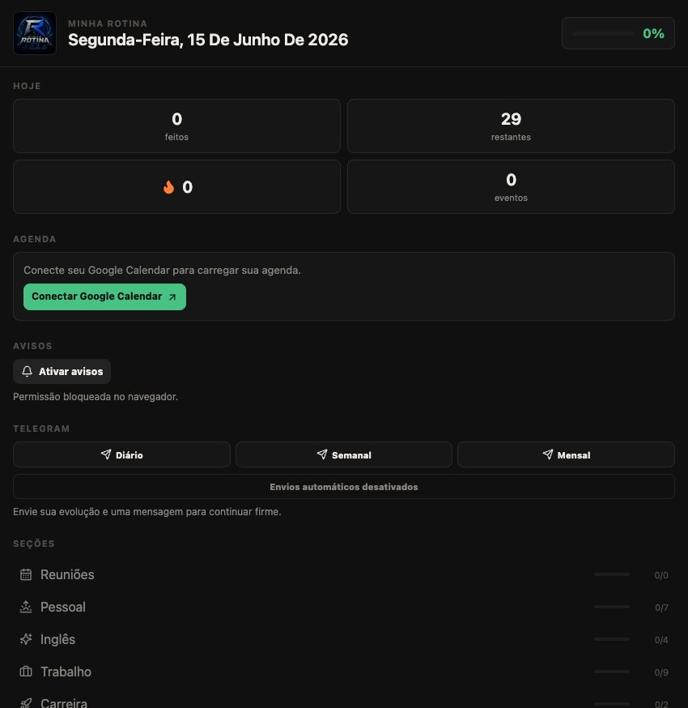
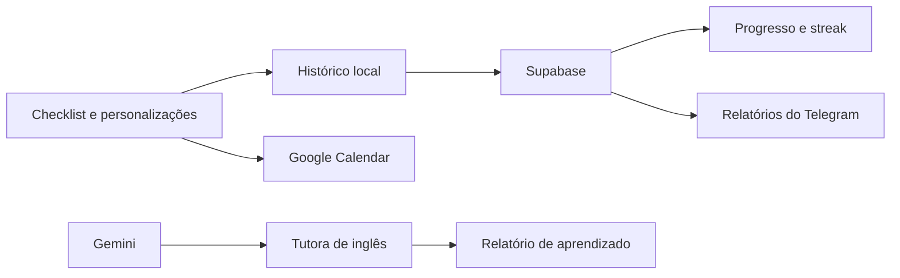

<div align="center">
  

  # Minha Rotina

  **Uma central pessoal para organizar o dia, acompanhar consistência e transformar progresso em motivação.**

  [Acessar aplicação](https://rotina-seven.vercel.app/) · [Funcionalidades](#funcionalidades) · [Rodar localmente](#rodar-localmente)

  
  
  
  
</div>



## Sobre o produto

Minha Rotina nasceu para reunir, em uma única experiência, o planejamento diário, compromissos, desenvolvimento profissional, saúde e aprendizado contínuo.

Em vez de usar vários aplicativos isolados, a aplicação organiza tarefas por blocos de horário, acompanha o progresso do dia, mantém um streak de consistência e conecta a rotina com Google Calendar, Telegram e uma tutora de inglês com IA.

## Funcionalidades

### Organização da rotina

- Rotinas diferentes para dias úteis, sábado e domingo.
- Blocos por horário para vida pessoal, inglês, trabalho, carreira, saúde, crescimento e finanças.
- Checklist diário com progresso geral e progresso por seção.
- Streak para acompanhar dias completamente concluídos.
- Edição de nomes, horários e tarefas.
- Criação e exclusão de tarefas personalizadas.
- Sincronização do histórico entre computador, celular e PWA quando o Supabase está configurado.

### Agenda e notificações

- Login seguro com Google OAuth.
- Leitura de múltiplos Google Calendars.
- Agenda lateral mostrando somente eventos com links de reunião.
- Detecção de Google Meet, Microsoft Teams, Zoom e outros provedores.
- Cadastro manual de reuniões recorrentes.
- Sincronização da rotina com o Google Calendar.
- Eventos da rotina com status de conclusão e lembrete antes do início.
- Avisos do próprio navegador quando um bloco da rotina começa.
- Instalação como PWA no celular, com ícone na tela inicial e aparência de aplicativo.

### Inglês com inteligência artificial

- Conversação voltada ao cotidiano de desenvolvimento de software.
- Prática de daily, bugs, tarefas, code review e entrevistas.
- Respostas faladas pela tutora e entrada por microfone em navegadores compatíveis.
- Correções durante a conversa.
- Relatório da sessão com gramática, comunicação, vocabulário técnico e próximos focos.
- Geração de arquivo com o relatório da prática.

### Relatórios pelo Telegram

- Relatórios diário, semanal e mensal.
- Progresso geral e detalhamento por seção.
- Streak atual e mensagem motivacional.
- Envios manuais pelos botões do app.
- Envios automáticos ao abrir o app depois das 20h.
- Proteção do endpoint por sessão do Google Calendar.

## Como funciona



As personalizações e o histórico funcionam no `localStorage` do navegador e, quando o Supabase está configurado, são sincronizados no banco. Tokens privados e chamadas externas ficam protegidos nas rotas de servidor do Next.js.

## Stack

| Área | Tecnologia |
| --- | --- |
| Aplicação | Next.js 15, React 18 e TypeScript |
| Interface | CSS modularizado e Lucide React |
| Inteligência artificial | Google Gemini |
| Agenda | Google Calendar API e OAuth 2.0 |
| Relatórios | Telegram Bot API |
| Sincronização | Supabase |
| Testes | Node Test Runner |
| Deploy | Vercel |

## Estrutura principal

```text
app/
  api/                 Rotas de autenticação, calendário, IA e Telegram
  components/          Componentes reutilizáveis da interface
  styles/              Estilos separados por responsabilidade
  EnglishTutor.tsx     Experiência de prática de inglês
  page.tsx             Composição e estado da página principal
lib/
  calendar.ts          Leitura e normalização de eventos
  google-auth.ts       Autenticação e renovação de tokens Google
  progress-history.ts  Reset, datas de relatório e streak
  routine.ts           Definição das rotinas
  telegram-report.ts   Validação e formatação dos relatórios
tests/                 Testes automatizados
```

## Rodar localmente

### Pré-requisitos

- Node.js 20 ou superior.
- Projeto OAuth configurado no Google Cloud.
- Chave do Gemini para utilizar a tutora de inglês.
- Bot do Telegram para utilizar os relatórios.

### Instalação

```bash
git clone https://github.com/Vinicius-Barbosa-Santos/rotina.git
cd rotina
npm install
cp .env.example .env.local
npm run dev
```

Abra [http://localhost:3000](http://localhost:3000).

## Variáveis de ambiente

```env
CALENDAR_TIMEZONE=America/Sao_Paulo
NEXT_PUBLIC_SITE_URL=http://localhost:3000

GOOGLE_CALENDAR_IDS=primary
GOOGLE_CLIENT_ID=
GOOGLE_CLIENT_SECRET=
GOOGLE_REDIRECT_URI=http://localhost:3000/api/auth/google/callback

GEMINI_API_KEY=
GEMINI_ENGLISH_TUTOR_MODEL=gemini-2.5-flash
GEMINI_ENGLISH_TUTOR_FALLBACK_MODEL=gemini-2.5-flash-lite
GEMINI_DAILY_CHAT_LIMIT=30
GEMINI_DAILY_SUMMARY_LIMIT=3
GEMINI_DAILY_TRANSCRIPTION_LIMIT=30

TELEGRAM_BOT_TOKEN=
TELEGRAM_CHAT_ID=

SUPABASE_URL=
SUPABASE_SERVICE_ROLE_KEY=
ROUTINE_SYNC_ID=vinicius-main
```

Nunca envie o `.env.local` para o GitHub. Em produção, configure as variáveis diretamente no painel da Vercel.

## Configurar integrações

### Google Calendar

1. Ative a Google Calendar API no Google Cloud.
2. Configure a tela de consentimento OAuth.
3. Crie um cliente OAuth do tipo **Aplicativo da Web**.
4. Adicione a origem e o callback locais ou da Vercel.
5. Configure `GOOGLE_CLIENT_ID`, `GOOGLE_CLIENT_SECRET` e `GOOGLE_REDIRECT_URI`.

Exemplo de callback em produção:

```text
https://seu-projeto.vercel.app/api/auth/google/callback
```

`GOOGLE_CALENDAR_IDS` aceita múltiplos IDs separados por vírgula. Use `primary` para o calendário principal da conta conectada.

### Gemini

1. Crie uma chave no Google AI Studio.
2. Configure `GEMINI_API_KEY`.
3. Use `gemini-2.5-flash` como modelo principal.

A chave fica somente no servidor. Evite enviar informações confidenciais durante as práticas.

### Telegram

1. Converse com `@BotFather` e crie um bot usando `/newbot`.
2. Abra o novo bot, clique em **Start** e envie uma mensagem.
3. Consulte `https://api.telegram.org/botSEU_TOKEN/getUpdates`.
4. Copie `message.chat.id` para `TELEGRAM_CHAT_ID`.
5. Configure o token e o Chat ID na Vercel.

O token do bot é secreto e nunca deve ser publicado.

### Supabase

1. Crie um projeto no Supabase.
2. Abra o editor SQL.
3. Rode o SQL abaixo:

```sql
create table if not exists public.routine_sync (
  id text primary key,
  data jsonb not null default '{}'::jsonb,
  updated_at timestamptz not null default now()
);
```

4. Copie a URL do projeto para `SUPABASE_URL`.
5. Copie a chave `service_role` para `SUPABASE_SERVICE_ROLE_KEY`.
6. Use `ROUTINE_SYNC_ID=vinicius-main` para manter uma única rotina pessoal sincronizada.

A chave `service_role` deve ficar somente no servidor, dentro da Vercel ou do `.env.local`.

## Persistência e relatórios

O histórico atual começa em **15 de junho de 2026**. O reset preserva tarefas personalizadas, horários, reuniões e integrações.

Chaves principais utilizadas no navegador:

- `rotina_preferences`
- `rotina_manual_meetings`
- `rotina_completed_dates`
- `rotina_next_YYYY-MM-DD`
- `rotina_telegram_reports_sent`

Com o Supabase configurado, o mesmo histórico passa a aparecer no computador, celular e PWA. Os relatórios automáticos ainda são enviados quando o app é aberto depois das 20h; para enviar com o app totalmente fechado, o próximo passo é criar uma rotina agendada no servidor.

## Qualidade

```bash
npm test
npm run build
```

Os testes cobrem datas, rotina, calendário, validação de relatórios, reset de histórico e cálculo do streak.

## Próximos passos

- Autenticação própria e perfis de usuário.
- Relatórios automáticos mesmo com o app fechado.
- Interações com tarefas diretamente pelo Telegram.

## Deploy

O projeto está conectado ao GitHub e publicado automaticamente pela Vercel a cada push na branch `master`.

Produção: [https://rotina-seven.vercel.app/](https://rotina-seven.vercel.app/)
