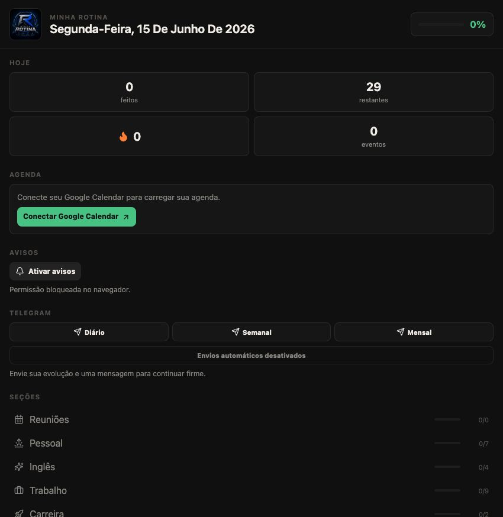
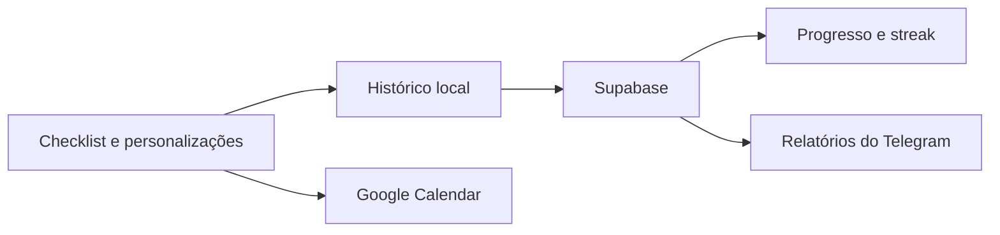

<div align="center">
  

  # Minha Rotina

  **Uma central pessoal para organizar o dia, acompanhar consistência e transformar progresso em motivação.**

  [Acessar aplicação](https://rotina-seven.vercel.app/) · [Funcionalidades](#funcionalidades) · [Rodar localmente](#rodar-localmente)

  
  
  
  
</div>



## Sobre o produto

Minha Rotina nasceu para reunir, em uma única experiência, o planejamento diário, compromissos, desenvolvimento profissional, saúde e aprendizado contínuo.

Em vez de usar vários aplicativos isolados, a aplicação organiza tarefas por blocos de horário, acompanha o progresso do dia, mantém um streak de consistência e conecta a rotina com Google Calendar e Telegram.

## Funcionalidades

### Organização da rotina

- Rotina principal organizada de segunda a sexta.
- Blocos por horário para a rotina e guias permanentes de inglês, desenvolvimento e vida funcional.
- Checklist diário com progresso geral e progresso por seção.
- Painel dedicado ao inglês, com hábitos do dia e domínio do guia completo.
- Stacks agrupadas por área, com ícones, trilhas completas em etapas marcáveis e progresso automático.
- Streak para acompanhar dias completamente concluídos.
- Edição de nomes, horários e tarefas.
- Criação e exclusão de tarefas personalizadas.
- Sincronização do histórico entre computador, celular e PWA quando o Supabase está configurado.

### Rotina atual

- **05:00-06:00:** café da manhã e preparação do dia.
- **06:00-09:00:** trabalho com programação.
- **09:00-10:00:** estudos técnicos com aula, código, exercícios e anotações.
- **10:00-11:00:** inglês.
- **11:00-12:00:** manutenção da casa e limpeza específica do dia.
- **12:00-13:30:** almoço, descanso e uma aula alternada de crescimento.
- **13:30-16:00:** reuniões e projetos; segunda e sexta priorizam organização e fechamento leve.
- **16:00-17:00:** Coders de terça a quinta.
- **17:00-18:00:** intervalo, hidratação, lanche e preparação para a academia.
- **18:00-19:00:** caminhada, bicicleta ou treino em casa com o app Home Workout; segunda e sexta são leves.
- **19:30-21:00:** jantar, banho e encerramento do dia.
- **21:00-05:00:** oito horas de sono.

As aulas de crescimento alternam entre YouTube, investimentos e marketing, com somente uma trilha por dia. Segunda e sexta reduzem a carga de projetos, não incluem Coders e usam caminhada, bicicleta ou mobilidade leve.

O Guia de Trilhas Técnicas organiza nove formações ativas — fundamentos de HTML, CSS e JavaScript, Full-Stack, React, Angular, Java, Node.js, GraphQL, AWS e desenvolvimento com IA. O painel também inclui uma trilha de inglês, com todas as competências organizadas dos fundamentos até a fluência e o uso profissional.

### Agenda e notificações

- Login seguro com Google OAuth.
- Leitura de múltiplos Google Calendars.
- Agenda lateral mostrando somente eventos com links de reunião.
- Detecção de Google Meet, Microsoft Teams, Zoom e outros provedores.
- Cadastro manual de reuniões recorrentes.
- Sincronização da rotina com o Google Calendar.
- Eventos da rotina com status de conclusão e lembrete antes do início.
- Avisos do próprio navegador quando um bloco da rotina começa.
- Instalação como PWA no celular, com ícone na tela inicial e aparência de aplicativo.

### Relatórios pelo Telegram

- Relatórios diário, semanal e mensal.
- Progresso geral e detalhamento por seção.
- Streak atual e mensagem motivacional.
- Envios manuais pelos botões do app.
- Envios automáticos pelo servidor às 23h (horário de São Paulo), mesmo com o app fechado.
- Proteção dos envios manuais pela sessão do Google e dos automáticos por `CRON_SECRET`.

## Como funciona


```mermaid
flowchart LR
    A["Checklist e personalizações"] --> B["Histórico local"]
    B --> C["Supabase"]
    C --> D["Progresso e streak"]
    C --> E["Relatórios do Telegram"]
    A --> I["Google Calendar"]
```

As personalizações e o histórico funcionam no `localStorage` do navegador e, quando o Supabase está configurado, são sincronizados no banco. Tokens privados e chamadas externas ficam protegidos nas rotas de servidor do Next.js.

## Stack

| Área | Tecnologia |
| --- | --- |
| Aplicação | Next.js 15, React 18 e TypeScript |
| Interface | CSS modularizado e Lucide React |
| Agenda | Google Calendar API e OAuth 2.0 |
| Relatórios | Telegram Bot API |
| Sincronização | Supabase |
| Testes | Node Test Runner |
| Deploy | Vercel |

## Estrutura principal

```text
app/
  api/                 Rotas de autenticação, calendário e Telegram
  components/          Componentes reutilizáveis da interface
  styles/              Estilos separados por responsabilidade
  page.tsx             Composição e estado da página principal
lib/
  calendar.ts          Leitura e normalização de eventos
  google-auth.ts       Autenticação e renovação de tokens Google
  progress-history.ts  Reset, datas de relatório e streak
  routine.ts           Definição das rotinas
  telegram-report.ts   Validação e formatação dos relatórios
tests/                 Testes automatizados
```

## Rodar localmente

### Pré-requisitos

- Node.js 20 ou superior.
- Projeto OAuth configurado no Google Cloud.
- Bot do Telegram para utilizar os relatórios.

### Instalação

```bash
git clone https://github.com/Vinicius-Barbosa-Santos/rotina.git
cd rotina
npm install
cp .env.example .env.local
npm run dev
```

Abra [http://localhost:3000](http://localhost:3000).

## Variáveis de ambiente

```env
CALENDAR_TIMEZONE=America/Sao_Paulo
NEXT_PUBLIC_SITE_URL=http://localhost:3000

GOOGLE_CALENDAR_IDS=primary
GOOGLE_CLIENT_ID=
GOOGLE_CLIENT_SECRET=
GOOGLE_REDIRECT_URI=http://localhost:3000/api/auth/google/callback

TELEGRAM_BOT_TOKEN=
TELEGRAM_CHAT_ID=
CRON_SECRET=

SUPABASE_URL=
SUPABASE_SERVICE_ROLE_KEY=
ROUTINE_SYNC_ID=vinicius-main
```

Nunca envie o `.env.local` para o GitHub. Em produção, configure as variáveis diretamente no painel da Vercel.

## Configurar integrações

### Google Calendar

1. Ative a Google Calendar API no Google Cloud.
2. Configure a tela de consentimento OAuth.
3. Crie um cliente OAuth do tipo **Aplicativo da Web**.
4. Adicione a origem e o callback locais ou da Vercel.
5. Configure `GOOGLE_CLIENT_ID`, `GOOGLE_CLIENT_SECRET` e `GOOGLE_REDIRECT_URI`.

Exemplo de callback em produção:

```text
https://seu-projeto.vercel.app/api/auth/google/callback
```

`GOOGLE_CALENDAR_IDS` aceita múltiplos IDs separados por vírgula. Use `primary` para o calendário principal da conta conectada.

### Telegram

1. Converse com `@BotFather` e crie um bot usando `/newbot`.
2. Abra o novo bot, clique em **Start** e envie uma mensagem.
3. Consulte `https://api.telegram.org/botSEU_TOKEN/getUpdates`.
4. Copie `message.chat.id` para `TELEGRAM_CHAT_ID`.
5. Configure o token, o Chat ID e uma chave longa em `CRON_SECRET` na Vercel.

O token do bot é secreto e nunca deve ser publicado.

### Supabase

1. Crie um projeto no Supabase.
2. Abra o editor SQL.
3. Rode o SQL abaixo:

```sql
create table if not exists public.routine_sync (
  id text primary key,
  data jsonb not null default '{}'::jsonb,
  updated_at timestamptz not null default now()
);
```

4. Copie a URL do projeto para `SUPABASE_URL`.
5. Copie a chave `service_role` para `SUPABASE_SERVICE_ROLE_KEY`.
6. Use `ROUTINE_SYNC_ID=vinicius-main` para manter uma única rotina pessoal sincronizada.

A chave `service_role` deve ficar somente no servidor, dentro da Vercel ou do `.env.local`.

## Persistência e relatórios

O histórico atual começa em **8 de setembro de 2026**. O dia 7 é feriado nacional e fica fora da contagem. O reset preserva tarefas personalizadas, horários, reuniões e integrações, mas reinicia o progresso dos guias e das trilhas.

Chaves principais utilizadas no navegador:

- `rotina_preferences`
- `rotina_manual_meetings`
- `rotina_completed_dates`
- `rotina_next_YYYY-MM-DD`
- `rotina_telegram_reports_sent`

Com o Supabase e o cron da Vercel configurados, os relatórios automáticos são enviados às 23h mesmo com o aplicativo fechado. Em dias úteis sai o relatório diário; aos domingos, o semanal; e no último dia do mês, o mensal.

## Qualidade

```bash
npm test
npm run build
```

Os testes cobrem datas, rotina, calendário, validação de relatórios, reset de histórico e cálculo do streak.

## Próximos passos

- Autenticação própria e perfis de usuário.
- Interações com tarefas diretamente pelo Telegram.

## Deploy

O projeto está conectado ao GitHub e publicado automaticamente pela Vercel a cada push na branch `master`.

Produção: [https://rotina-seven.vercel.app/](https://rotina-seven.vercel.app/)
